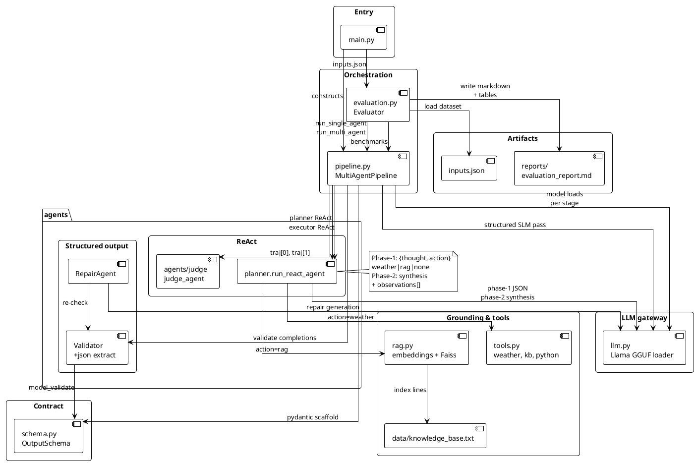
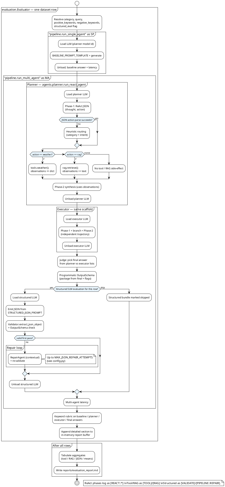
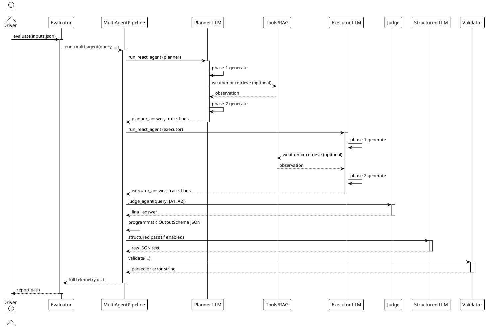

# Multi-Agent SLM — academic coursework artefact

**Context:** Hands-on LLM course (**CCE IISc**). This repo supports **`Proposal.md`** and writes evidence under **`reports/`**. It is a **pedagogical prototype** (measurement + exposition), **not** a production product.

## Overview

What this submission contains, aligned with the proposal:

- Sequential **Thought → Action → Observation** ReAct passes for both planner *and* executor agents.
- **Multi-agent deliberation**: independent trajectories that merge through a heuristic **judge** (self-consistency proxy).
- **Structured JSON conformance** exercised via pydantic **`OutputSchema`**, **`Validator`**, and an LLM **repair** pass.
- **Tooling + RAG** demos with safeguards for exaggerated live-tool activation (“tool restraint” scenarios).
- Keyword-style **evaluation harness** emitting markdown under **`reports/`** suitable for annexes in a coursework report.

Operational setup matches a **student / lab** setting: local **GGUF** models via **`llama.cpp`**, sequential load/unload for tight VRAM, and optional **RSS** readouts. **KV-cache state is not persisted** between stages; benchmark text may still mention KV-cache as a *topic*.

---

## Architecture (PlantUML)


### Components and dependencies

Static view of modules and external resources.



### End-to-end benchmark flow

One row from `inputs.json`: **sequential** baseline, then multi-agent path (planner → executor → judge → structured pass), then scoring and report lines. Matches `evaluation.py` + `pipeline.py`.



### Multi-agent message flow (sequence sketch)



The diagram shows **one `run_multi_agent`** call; the evaluator still runs **`run_single_agent` first** each row (baseline), then this path, then rubric + appendix materialization.

### ReAct detail (within each agent turn)

Each ReAct trajectory logs explicit phases:

1. **Phase‑1 SLM JSON** deciding among `{weather,rag,none}` (keyword fallbacks preserved for robustness).
2. Deterministic branching + observation capture (`[TOOL]` / `[RAG]`).
3. **Phase‑2 SLM synthesis** consuming serialized observations (`[REACT::*]` prefixed trace lines).

### Agent roster

| Component | Responsibility |
|-----------|----------------|
| Planner | Early reasoning trajectory + guarded tool/RAG selection |
| Executor | Parallel factual trajectory with identical routing discipline |
| Judge | Lightweight self-consistency: prefers grounding / external evidence cues |
| Validator | JSON extraction + `OutputSchema` checks |
| RepairAgent | Regenerates JSON conditioned on diagnostics |
| Evaluator | Drives benchmarks, aggregates ablation-friendly metrics |

---

## What is benchmarked? (`inputs.json`)

Six curated cases — **roughly one per proposal theme** — so the report appendix maps cleanly to coursework claims:

| Bucket | What it evidences |
|--------|---------------------|
| `reasoning_tradeoffs` | Multi-step reasoning under hardware limits (VRAM / quantization / latency narratives) |
| `rag_grounding` | Why + when retrieval mitigates hallucinations under latency pressure |
| `tool_calling` | Correct live-ish tool use (`wttr.in` sample) |
| `tool_restraint` | No live APIs when user asked only for illustrative API code |
| `misinformation_resistance` | Pushing back on false technical premises |
| `structured_output` | Storyline for pydantic validators, JSON repair, judge (ties to structured-output deliverable) |

Optional per-field `proof_point` is echoed in **reports** as human-readable linkage to Proposal.md sections.

Extend or trim `inputs.json` as long as rows keep `category`, `query`, `positive_keywords`, and `negative_keywords`.

---

## Dataset format (`inputs.json`)

Each record resembles:

```json
{
  "category": "...",
  "proof_point": "optional short label for the report",
  "query": "...",
  "positive_keywords": ["..."],
  "negative_keywords": ["..."]
}
```

**Structured JSON conformance** (Proposal § structured outputs): enabled **by default** for every row via `DEFAULT_STRUCTURED_LLM_EVAL = True` in [`config.py`](config.py). The evaluator asks the structured SLM to emit JSON matching [`schema.OutputSchema`](schema.py), runs [`agents/validator.py`](agents/validator.py), and applies repairs when configured.

Optional per‑row override: set `"structured_eval": false` in a benchmark record to skip that pass (for example faster smoke runs or rows where JSON KPIs do not matter). You do **not** need `"structured_eval": true` on every line when the global default stays on.

---

## Outputs

Primary artifact: **`reports/evaluation_report.md`** (configured via `EVALUATION_REPORT_PATH`).

Contents include consolidated tables plus per-case appendix with:

- ReAct trace snippets (`planner_react_trace`, `executor_react_trace`)
- Observation dumps
- Structured-output telemetry payloads

Historical console logs continue to annotate execution with prefixed channels:

| Prefix | Role |
|--------|------|
| `[SYS]` | Model lifecycle checkpoints |
| `[LLM]` | Short inference breadcrumbs (suppressed GGML chatter via env knobs) |
| `[REACT::*]` | Per-agent phase transitions |
| `[TOOL]` | Tool channel activity |
| `[RAG]` | Retrieval summaries |
| `[VALIDATE]` | JSON / schema adjudication |
| `[PIPELINE::*]` | Cross-agent orchestration |
| `[EVAL]` | Benchmark harness progression |
| `[BENCHMARK]` | Aggregate KPI announcements |
| `[PROOF]` | Narrative “proof hooks” surfaced to stdout |
| `[ERROR]` | Recoverable/hard failures (tools, loaders, Llama/API, filesystem, schema) |

Supporting directories:

```
project/
├── agents/            # planner, judge, validator, repair
├── data/
├── reports/           # generated markdown dossiers + tables
├── states/            # optional placeholder directory (unused in current runs)
├── config.py          # GGUF pointers, prompts, repair limits, filesystem constants
├── logger.py          # shared console helpers
├── schema.py          # pydantic `OutputSchema`
├── llm.py             # GGUF-backed llama-cpp wrapper + quiet inference defaults
├── rag.py             # embedding + Faiss index over `data/knowledge_base.txt`
├── tools.py           # deterministic + external bridging utilities
├── pipeline.py        # multi-agent assembly + structured-output loop hooks
├── evaluation.py      # driver + markdown synthesis
├── main.py            # orchestrated entrypoint (`python main.py`)
├── inputs.json        # authored evaluation tasks
├── requirements.txt
├── Proposal.md
└── README.md
```

---

## Running locally

```bash
python -m venv venv
source venv/bin/activate        # PowerShell: venv\Scripts\Activate.ps1
pip install -r requirements.txt # pulls pydantic≥2 & psutil for telemetry helpers
python main.py
```

> **Models:** GGUF checkpoints referenced in [`config.py`](config.py) are *not* vendored inside git—download them separately and preserve the configured relative filenames.

[`run.bat`](run.bat) automates env creation + installs + `python main.py` on Windows workstations.

---

## Evaluation metrics surfaced

| KPI | Interpretation |
|-----|----------------|
| Keyword accuracy (single vs multi vs planner-only) | Proxy for textual alignment with heuristic rubrics |
| Tool expectation alignment | Scripted expectations for categories with crisp ground truth (`tool_calling`, `tool_restraint`, …) |
| Retrieval alignment | Tracks whether `rag_*` cases invoke vector retrieval |
| JSON validity (`first-shot` vs `post-repair`) | Captures Proposal §5 structured-output KPIs whenever structured evaluation runs |
| Repair iterations mean | Signals how often malformed JSON persists without correction |
| RSS snapshots | Lightweight resource proxy for experimentation memos |

These indicators intentionally mix **automatic rubrics** (keyword overlap) with **structural conformance** telemetry—see “Current limitations.”

---

## Current limitations & roadmap

| Limitation | Mitigation roadmap |
|-----------|---------------------|
| Judge is heuristic—not a hosted Mistral rollout by default | Optional upgrade path: hydrate `AGENT_MODELS["judge"]` + extend `agents/judge.py` |
| Keyword scoring is brittle | Semantic rerankers / LLM-as-judge overlays |
| ReAct parsers depend on tolerant JSON slicing | Logging & fallbacks mitigate, but tighter grammars/Trie decoding help |
| Evaluation favors reproducibility (sequential loads) over maximum tokens/sec | Consolidate deployment once benchmarks are finalized |

Patches welcome—keep evaluation reproducible (`TEMPERATURE`, sequential loading) unless explicitly experimenting.

---

## How README maps to Proposal.md

| Proposal theme | Implemented surface |
|----------------|---------------------|
| ReAct iterative reasoning | Two-phase prompting + annotated traces logged per SLM actor |
| Multi-agent deliberation | Planner vs executor divergence merged under judge logic |
| Self-consistency | Judge comparison + auxiliary “planner-only” scoring column |
| Structured JSON + validator + repairs | pydantic constraints + iterative LLM remediation |
| RAG grounding | Sentence Transformer embeddings + Faiss nearest neighbors |
| Resource awareness | GGUF quantization, sequential unloading, coarse RSS metering |
| Experimental baselines (`inputs.json`) | Mirrors proposal task buckets including structured-output probing |

Deliverable alignment:

- ✅ Code modules for planner / executor / judge / validator / repair.
- ✅ CLI workflow (`python main`) with verbose trace-friendly logging but quiet GGUF backends by default.
- ✅ Markdown report detailing tables + appendix suitable for coursework submission.

Outstanding optional stretch goals (beyond this README snapshot): hosted judge SLM, richer ablation CLI flags, lightweight interactive demos.

---

## Notes (academic scope)

Treat scores and tooling behaviour as **evidence for a written report**, not benchmarks for a shipped product:

1. Keyword rubrics are **deliberately simple** for transparency and reproducibility in grading.
2. The live weather stub is **pedagogical** (real HTTP), not monitored infrastructure.
3. Extend [`inputs.json`](inputs.json) and [`Proposal.md`](Proposal.md) together when you revise hypotheses for your submission.

---

## Appendix: why this differs from production software

| Aspect | Here (course) | Typical product |
|--------|----------------|----------------|
| Goal | Explain methods + show measurements | Reliable UX, compliance, uptime |
| Quality bar | Readable logs + appendix markdown | Alerts, quotas, retries, audits |
| Models | Bring-your-own GGUF paths | Managed APIs + routing |
